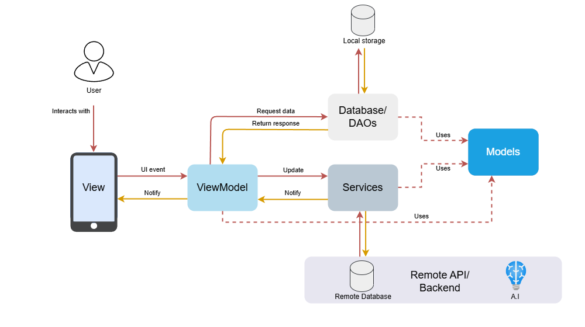

# Architecture

This document provides a high-level overview of the SnapChef application's architecture, design patterns, and major components.

## Architectural Pattern

SnapChef follows the **MVVM (Model-View-ViewModel)** pattern for clear separation of concerns and maintainability:

- **Model:** Represents the app’s data structures (e.g., User, Recipe, Ingredient).
- **View:** UI screens and widgets that display data and handle user interaction.
- **ViewModel:** Connects the UI to business logic, manages state, and communicates with services and models.

## Main Layers & Responsibilities

| Layer         | Responsibilities                                                                 |
|---------------|----------------------------------------------------------------------------------|
| **Models**    | Data classes, serialization/deserialization, and business entities.              |
| **Views**     | UI screens, pages, and reusable widgets.                                         |
| **ViewModels**| State management, business logic, and data flow between views and services.      |
| **Services**  | API communication, authentication, and integration with external services.       |
| **Database**  | Local persistence using Floor (SQLite ORM), DAOs, and database classes.          |
| **Utils**     | Helper functions and utilities for formatting, validation, etc.                  |
| **Theme**     | App-wide theming, color schemes, and text styles.                                |
| **Constants** | Application-wide constant values and configuration.                              |

## Data Flow

1. **User interacts with the View (UI).**
2. **ViewModel** receives events, updates state, and requests data from **Services** or **Database**.
3. **Services** handle API calls, authentication, and third-party integrations.
4. **Database** provides local data persistence and caching.
5. **ViewModel** updates the View with new data or state.

## Third-party Integrations

- **Google Cloud Vision & ML Kit:** Ingredient recognition from images and barcodes.
- **Google Generative AI & Vertex AI:** Recipe and image generation.
- **Firebase Cloud Messaging:** Push notifications.
- **MongoDB:** Backend database for persistent storage.
- **WebSockets:** Real-time updates and communication.

## State Management

- Uses **Provider** for dependency injection and state management.
- ViewModels expose state to Views and notify them of changes.

## Folder Structure

See [`lib/README.md`](/lib/README.md) for a detailed breakdown of the source code organization.

## Diagrams

## Further Reading

- [MVVM Pattern in Flutter](https://docs.flutter.dev/app-architecture/guide)
- [App State Management](https://docs.flutter.dev/development/data-and-backend/state-mgmt/simple)
- [Provider Package Documentation](https://pub.dev/packages/provider)
- [Floor ORM Documentation](https://pub.dev/packages/floor)
